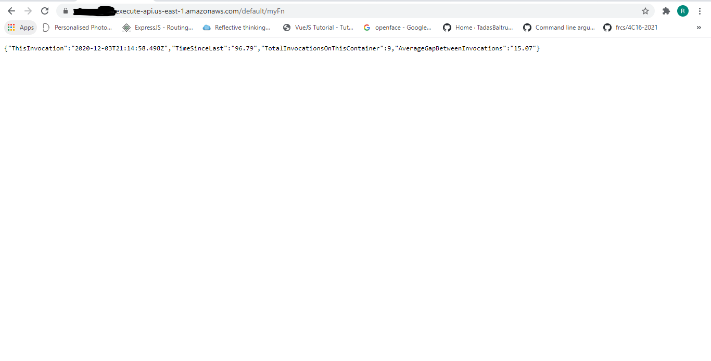

# AWS-Lambda
## Web PAge Function

This function shows the following in the browser:
- The time of the invocation
- The time elapsed since the lastinvocation
- The total number of invocations on the container
- The average amount of time elapsed between invocations

